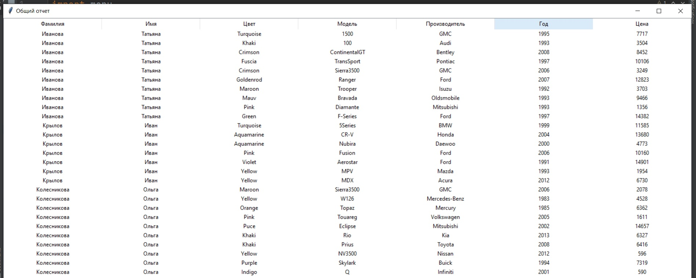

Информационная база сотрудников автосалона и учета проданных машин
# Список модулей
## 1. Модуль main
Запускает работу программы
## 2. Модуль menu
### Список функций
* **data_menu()** - отвечает за окно основного меню

* **wind_1()** - окно общего отчета по всем данным

* **wind_2()** - окно вывода списка всех сотрудников, с поиском по фамилии

* **wind_4()** - окно вывода общей суммы продаж

* **wind_5()** - окно вывода суммы продаж по сотрудникам

* **wind_3()** - окно вывода информации по продажам конкретного сотрудника, заданного поиском
! работает не корректно, не могу настроить, чтобы данные, вводимые в Entry(фамилия сотрудника), передавались в функцию surname_search() и отрабатывали ее
## 3. Модуль export
### Список функций
* **all_data()** - функция для вывода всей информации из БД
* **all_employee()** - функция для вывода списка всех сотрудников
* **all_sum()** - функция для вывода общей суммы продаж
* **empl_sum** - функция для вывода списка сотрудников с суммами их продаж
* **surname_search()** - функция вывода списка продаж по конкретному сотруднику 